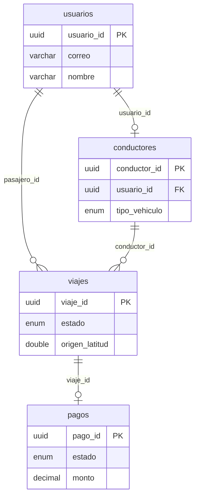

# Seed PostgreSQL — registros propuestos

## Contexto

- Base: PostgreSQL en [`docker-compose.yml`](docker-compose.yml) (`uber_viajes`)
- Schema: [`src/db/schema.ts`](src/db/schema.ts) — 4 tablas relacionales
- Implementación prevista: script `src/db/seed.ts` + script npm `db:seed` (tras tu aprobación)
- Ubicación: **Buenos Aires (CABA)** — mismas coordenadas que los ejemplos de [`message.md`](message.md)
- Moneda: **ARS** (pesos argentinos) — código ISO `ARS` en todos los pagos; montos de tarifas también en pesos
- **Mínimo requerido: ≥10 registros en cada entidad**

## Resumen de volumen

| Tabla         | Cantidad | Notas                                                                 |
| ------------- | -------- | --------------------------------------------------------------------- |
| `usuarios`    | **18**   | 10 conductores + 8 pasajeros                                          |
| `conductores` | **10**   | Solo uberX, uberXL y black — **sin moto**                             |
| `viajes`      | **12**   | Cubre los 5 estados de `estado_viaje`                                 |
| `pagos`       | **10**   | Cubre los 4 estados de `estado_pago`; 2 viajes sin pago intencional |

---

## 1. `usuarios` (18 registros)

### Conductores (10)

| usuario_id                             | correo                       | telefono       | nombre           | activo |
| -------------------------------------- | ---------------------------- | -------------- | ---------------- | ------ |
| `550e8400-e29b-41d4-a716-446655440000` | carlos.ruiz@example.com      | +5491123456701 | Carlos Ruiz      | true   |
| `550e8400-e29b-41d4-a716-446655440010` | ana.morales@example.com      | +5491123456702 | Ana Morales      | true   |
| `550e8400-e29b-41d4-a716-446655440011` | diego.castro@example.com     | +5491123456703 | Diego Castro     | true   |
| `550e8400-e29b-41d4-a716-446655440012` | paula.herrera@example.com    | +5491123456704 | Paula Herrera    | true   |
| `550e8400-e29b-41d4-a716-446655440013` | martin.vega@example.com      | +5491123456705 | Martín Vega      | true   |
| `550e8400-e29b-41d4-a716-446655440014` | laura.navarro@example.com    | +5491123456706 | Laura Navarro    | true   |
| `550e8400-e29b-41d4-a716-446655440015` | roberto.soto@example.com     | +5491123456707 | Roberto Soto     | true   |
| `550e8400-e29b-41d4-a716-446655440016` | elena.torres@example.com     | +5491123456708 | Elena Torres     | true   |
| `550e8400-e29b-41d4-a716-446655440017` | facundo.rios@example.com     | +5491123456709 | Facundo Ríos     | true   |
| `550e8400-e29b-41d4-a716-446655440018` | gabriela.acosta@example.com  | +5491123456710 | Gabriela Acosta  | false  |

### Pasajeros (8)

| usuario_id                             | correo                          | telefono       | nombre              | activo |
| -------------------------------------- | ------------------------------- | -------------- | ------------------- | ------ |
| `770e8400-e29b-41d4-a716-446655440002` | maria.garcia@example.com        | +5491198765401 | María García        | true   |
| `770e8400-e29b-41d4-a716-446655440003` | juan.perez@example.com          | +5491198765402 | Juan Pérez          | true   |
| `770e8400-e29b-41d4-a716-446655440004` | sofia.lopez@example.com         | +5491198765403 | Sofía López         | true   |
| `770e8400-e29b-41d4-a716-446655440005` | lucas.martinez@example.com      | +5491198765404 | Lucas Martínez      | true   |
| `770e8400-e29b-41d4-a716-446655440006` | valentina.rodriguez@example.com | +5491198765405 | Valentina Rodríguez | true   |
| `770e8400-e29b-41d4-a716-446655440007` | mateo.fernandez@example.com     | +5491198765406 | Mateo Fernández     | true   |
| `770e8400-e29b-41d4-a716-446655440008` | camila.diaz@example.com         | +5491198765407 | Camila Díaz         | true   |
| `770e8400-e29b-41d4-a716-446655440009` | tomas.suarez@example.com        | +5491198765408 | Tomás Suárez        | false  |

> `Tomás Suárez` (pasajero) y `Gabriela Acosta` (conductora) quedan **inactivos** para probar filtros.

---

## 2. `conductores` (10 registros)

Campo `licencia`: **patente argentina formato Mercosur** — `AA000AA` (2 letras + 3 dígitos + 2 letras, sin espacios ni guiones).

| conductor_id                           | usuario_id           | licencia (patente) | tipo_vehiculo | calificacion | viajes_total | activo |
| -------------------------------------- | -------------------- | ------------------ | ------------- | ------------ | ------------ | ------ |
| `660e8400-e29b-41d4-a716-446655440010` | `550e8400-...440000` | AB123CD            | uberX         | 4.92         | 1247         | true   |
| `660e8400-e29b-41d4-a716-446655440011` | `550e8400-...440010` | AC456EF            | uberXL        | 4.85         | 892          | true   |
| `660e8400-e29b-41d4-a716-446655440012` | `550e8400-...440011` | AD789GH            | black         | 4.98         | 2103         | true   |
| `660e8400-e29b-41d4-a716-446655440013` | `550e8400-...440012` | AE012IJ            | black         | 4.76         | 456          | true   |
| `660e8400-e29b-41d4-a716-446655440014` | `550e8400-...440013` | AF345KL            | uberX         | 4.65         | 178          | false  |
| `660e8400-e29b-41d4-a716-446655440015` | `550e8400-...440014` | AG678MN            | uberX         | 4.88         | 634          | true   |
| `660e8400-e29b-41d4-a716-446655440016` | `550e8400-...440015` | AH901OP            | uberXL        | 4.71         | 312          | true   |
| `660e8400-e29b-41d4-a716-446655440017` | `550e8400-...440016` | AI234QR            | black         | 4.95         | 1580         | true   |
| `660e8400-e29b-41d4-a716-446655440018` | `550e8400-...440017` | AJ567ST            | uberX         | 4.82         | 723          | true   |
| `660e8400-e29b-41d4-a716-446655440019` | `550e8400-...440018` | AK890UV            | uberXL        | 4.90         | 945          | false  |

> `Martín Vega` y `Gabriela Acosta` (conductores) quedan **inactivos**. No se usa el tipo `moto`.

---

## 3. `viajes` (12 registros)

Fechas base: **2025-05-22** (alineado al ejemplo del documento). Timestamps en UTC.

| #   | viaje_id                               | pasajero  | conductor | estado          | origen (lat, lng)                  | destino (lat, lng)                 | distancia_km | duracion_min | tarifa_base (ARS) | mult | tarifa_total (ARS) |
| --- | -------------------------------------- | --------- | --------- | --------------- | ---------------------------------- | ---------------------------------- | ------- | ------- | ----------------- | ---- | ------------------ |
| V1  | `660e8400-e29b-41d4-a716-446655440001` | María     | Carlos    | **completado**  | Obelisco (-34.6037, -58.3816)      | Recoleta (-34.5875, -58.3952)      | 4.2     | 18      | 5000.00           | 1.2  | **8900.00**        |
| V2  | `660e8400-e29b-41d4-a716-446655440002` | Juan      | Ana       | **en_progreso** | Palermo (-34.5810, -58.4200)       | Puerto Madero (-34.6100, -58.3630) | null    | null    | 6500.00           | 1.0  | null               |
| V3  | `660e8400-e29b-41d4-a716-446655440003` | Sofía     | Diego     | **aceptado**    | Congreso (-34.6097, -58.3926)      | San Telmo (-34.6212, -58.3731)     | null    | null    | 4000.00           | 1.0  | null               |
| V4  | `660e8400-e29b-41d4-a716-446655440004` | Lucas     | Paula     | **solicitado**  | Caballito (-34.6187, -58.4412)     | Aeroparque (-34.5592, -58.4156)    | null    | null    | 7000.00           | 1.5  | null               |
| V5  | `660e8400-e29b-41d4-a716-446655440005` | Valentina | Martín    | **cancelado**   | Recoleta (-34.5875, -58.3952)      | Palermo (-34.5810, -58.4200)       | null    | null    | 5500.00           | 1.0  | null               |
| V6  | `660e8400-e29b-41d4-a716-446655440006` | Mateo     | Carlos    | **completado**  | Puerto Madero (-34.6100, -58.3630) | Obelisco (-34.6037, -58.3816)      | 3.1     | 14      | 4500.00           | 1.0  | **6200.00**        |
| V7  | `660e8400-e29b-41d4-a716-446655440007` | Camila    | Ana       | **completado**  | San Telmo (-34.6212, -58.3731)     | Congreso (-34.6097, -58.3926)      | 2.8     | 12      | 4000.00           | 1.0  | **5400.00**        |
| V8  | `660e8400-e29b-41d4-a716-446655440008` | Tomás     | Diego     | **completado**  | Aeroparque (-34.5592, -58.4156)    | Caballito (-34.6187, -58.4412)     | 8.5     | 28      | 9000.00           | 1.3  | **14800.00**       |
| V9  | `660e8400-e29b-41d4-a716-446655440009` | María     | Paula     | **completado**  | Palermo (-34.5810, -58.4200)       | Recoleta (-34.5875, -58.3952)      | 3.6     | 15      | 5000.00           | 1.0  | **7100.00**        |
| V10 | `660e8400-e29b-41d4-a716-44665544000a` | Juan      | Carlos    | **completado**  | Obelisco (-34.6037, -58.3816)      | Puerto Madero (-34.6100, -58.3630) | 2.5     | 10      | 4000.00           | 1.0  | **5000.00**        |
| V11 | `660e8400-e29b-41d4-a716-44665544000b` | Sofía     | Laura     | **completado**  | Belgrano (-34.5627, -58.4558)      | Nuñez (-34.5436, -58.4617)         | 5.3     | 20      | 5500.00           | 1.0  | **8300.00**        |
| V12 | `660e8400-e29b-41d4-a716-44665544000c` | Lucas     | Roberto   | **completado**  | Flores (-34.6290, -58.4638)        | Boedo (-34.6250, -58.4120)         | 4.0     | 16      | 4800.00           | 1.1  | **7500.00**        |

### Timestamps por viaje

| Viaje | solicitado_en | aceptado_en | fecha_partida | fecha_llegada          |
| ----- | ------------- | ----------- | --------- | ---------------------- |
| V1    | 10:00:00      | 10:00:15    | 10:04:30  | 10:22:45               |
| V2    | 14:10:00      | 14:10:20    | 14:15:00  | —                      |
| V3    | 16:30:00      | 16:30:18    | —         | —                      |
| V4    | 18:00:00      | —           | —         | —                      |
| V5    | 11:45:00      | 11:45:30    | —         | — (cancelado 11:48:00) |
| V6    | 09:00:00      | 09:00:12    | 09:05:00  | 09:19:00               |
| V7    | 13:20:00      | 13:20:25    | 13:25:00  | 13:37:00               |
| V8    | 20:00:00      | 20:00:40    | 20:08:00  | 20:36:00               |
| V9    | 15:00:00      | 15:00:10    | 15:04:00  | 15:19:00               |
| V10   | 08:30:00      | 08:30:08    | 08:33:00  | 08:43:00               |
| V11   | 17:00:00      | 17:00:22    | 17:05:00  | 17:25:00               |
| V12   | 19:30:00      | 19:30:35    | 19:35:00  | 19:51:00               |

> **V1** replica el viaje del ejemplo en `message.md` (María + Carlos, Obelisco→Recoleta, **$8.900 ARS**).

---

## 4. `pagos` (10 registros)

| pago_id                                | viaje_id | monto (ARS) | moneda | metodo            | estado          | procesado_en        |
| -------------------------------------- | -------- | ----------- | ------ | ----------------- | --------------- | ------------------- |
| `880e8400-e29b-41d4-a716-446655440001` | V1       | 8900.00     | **ARS** | tarjeta_credito   | **capturado**   | 2025-05-22 10:23:00 |
| `880e8400-e29b-41d4-a716-446655440002` | V2       | 6500.00     | **ARS** | tarjeta_debito    | **pendiente**   | —                   |
| `880e8400-e29b-41d4-a716-446655440003` | V3       | 4000.00     | **ARS** | tarjeta_credito   | **pendiente**   | —                   |
| `880e8400-e29b-41d4-a716-446655440004` | V6       | 6200.00     | **ARS** | tarjeta_debito    | **capturado**   | 2025-05-22 09:19:30 |
| `880e8400-e29b-41d4-a716-446655440005` | V7       | 5400.00     | **ARS** | efectivo          | **capturado**   | 2025-05-22 13:37:30 |
| `880e8400-e29b-41d4-a716-446655440006` | V8       | 14800.00    | **ARS** | tarjeta_credito   | **fallido**     | 2025-05-22 20:36:30 |
| `880e8400-e29b-41d4-a716-446655440007` | V9       | 7100.00     | **ARS** | tarjeta_debito    | **reembolsado** | 2025-05-22 15:20:00 |
| `880e8400-e29b-41d4-a716-446655440008` | V10      | 5000.00     | **ARS** | efectivo          | **capturado**   | 2025-05-22 08:43:30 |
| `880e8400-e29b-41d4-a716-446655440009` | V11      | 8300.00     | **ARS** | tarjeta_debito    | **capturado**   | 2025-05-22 17:25:30 |
| `880e8400-e29b-41d4-a716-44665544000a` | V12      | 7500.00     | **ARS** | efectivo          | **capturado**   | 2025-05-22 19:51:30 |

### Viajes sin pago (intencional)

| Viaje           | Motivo                                              |
| --------------- | --------------------------------------------------- |
| V4 (solicitado) | Viaje recién creado, aún sin flujo de cobro         |
| V5 (cancelado)  | Cancelado antes de la partida — sin entidad de pago |

---

## Diagrama de relaciones

---

## Implementación (tras aprobación)

1. Crear [`src/db/seed.ts`](src/db/seed.ts) con inserts vía Drizzle ORM (mismos tipos que [`schema.ts`](src/db/schema.ts))
2. Agregar script `"db:seed": "tsx src/db/seed.ts"` en [`package.json`](package.json)
3. Actualizar default de `moneda` en [`src/db/schema.ts`](src/db/schema.ts) de `USD` a `ARS` (coherente con operación en Argentina)
4. El seed será **idempotente**: `TRUNCATE ... CASCADE` al inicio para desarrollo local
5. Orden de inserción: `usuarios` → `conductores` → `viajes` → `pagos`

## Qué cubre este dataset

- **≥10 registros en cada entidad** (18 / 10 / 12 / 10)
- Todos los valores de `estado_viaje` y `estado_pago`
- Tipos de vehículo usados: `uberX`, `uberXL`, `black` (sin `moto`)
- Métodos de pago usados: `tarjeta_credito`, `tarjeta_debito`, `efectivo` (sin `billetera_virtual`)
- Pasajero con múltiples viajes (María: V1 + V9; Sofía: V3 + V11)
- Conductor con múltiples viajes (Carlos: V1, V6, V10)
- Usuarios y conductores inactivos
- Viaje con surge (`multiplicador > 1`) y sin tarifa final calculada
- UUIDs reutilizables si más adelante se seedea Cassandra con los mismos IDs
