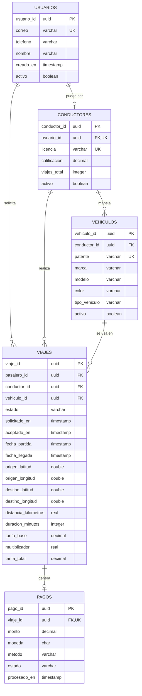

# Diagramas de base de datos

## Diagrama entidad-relación MySQL

## Diagrama/tabla Cassandra

Tabla `conductores_por_zona`.

| Nombre | Tipo | Observación |
|--------|------|-------------|
| `geohash` | `text` | PK = PARTITION KEY |
| `tipo_vehiculo` | `text` | CK = CLUSTERING KEY |
| `calificacion` | `decimal` | CK = CLUSTERING KEY |
| `patente` | `text` | CK = CLUSTERING KEY |
| `nombre` | `text` |  |
| `licencia` | `text` |  |
| `viajes_total` | `int` |  |
| `marca` | `text` |  |
| `modelo` | `text` |  |
| `color` | `text` |  |
| `updated_at` | `timestamp` |  |
