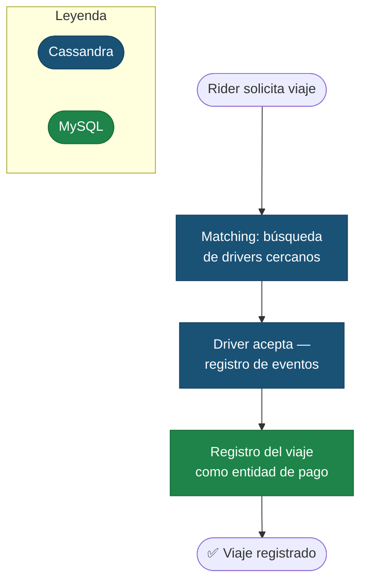
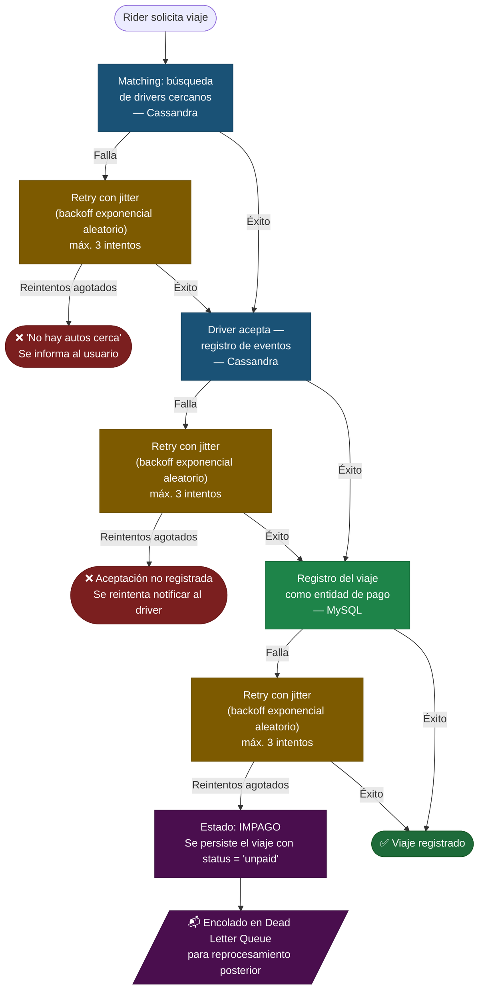
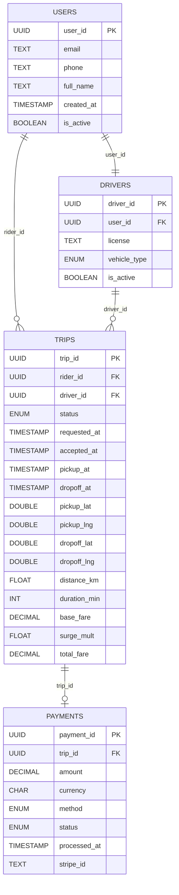
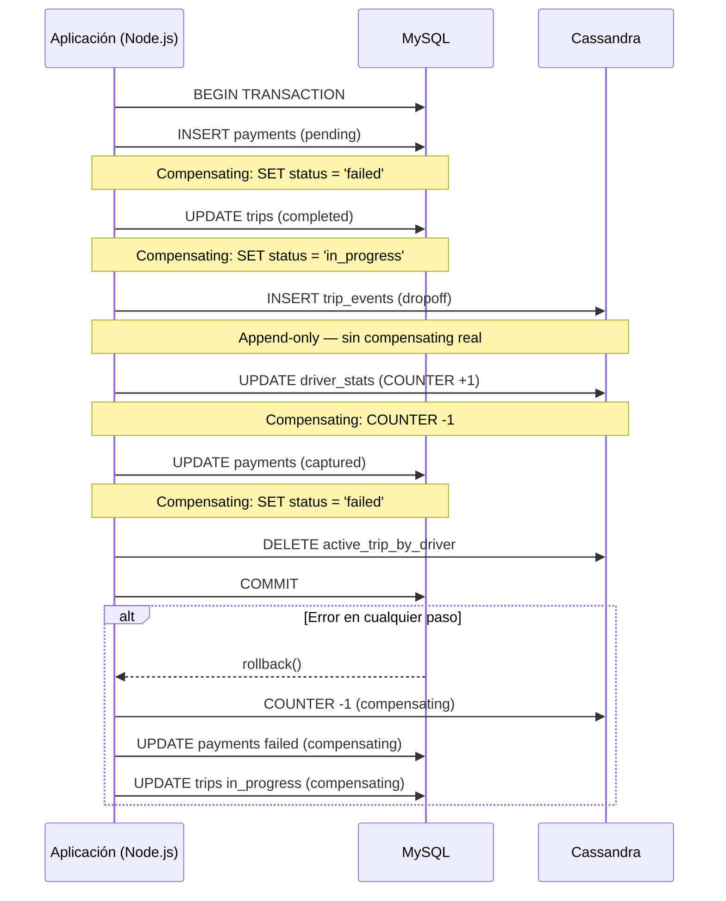

# Trabajo Práctico: Integración de Bases Relacionales y No Relacionales

**Plataforma elegida:** Uber  
**Funcionalidad analizada:** Solicitud y ciclo de vida de un viaje (_trip lifecycle_)  
**Lenguaje:** TypeScript (Node.js)

---

## 1. Introducción y elección de plataforma

Uber es una plataforma de ride-hailing que opera en más de 70 países y procesa millones de viajes diarios. Su arquitectura de datos es un caso de estudio canónico en la industria porque combina múltiples paradigmas de bases de datos para resolver problemas fundamentalmente distintos dentro de una misma funcionalidad.

La funcionalidad elegida es el **ciclo de vida de un viaje**: desde que un rider solicita el viaje, pasando por el matching con un driver, la aceptación, el pickup, la ejecución del viaje, y el dropoff con el cobro final. Este flujo involucra naturalmente:

- Datos altamente estructurados con requerimientos ACID (cobro, suscripción)
- Datos de alta velocidad y volumen sin necesidad de consistencia fuerte (ubicaciones, eventos)

Esta dualidad hace al ciclo de vida del viaje el ejemplo perfecto para justificar el uso de una arquitectura **polyglot persistence**.

---

## 2. Funcionalidad analizada: el ciclo de vida de un viaje

Las tres etapas analizadas en este trabajo, desde la perspectiva de datos, son:

```
Rider solicita viaje
        │
   [Matching: búsqueda de drivers cercanos]   → Cassandra
        │
   [Driver acepta — registro de eventos]      → Cassandra
        │
   [Registro del viaje como entidad de pago]  → MySQL
        │
   [Viaje registrado]
```

Estas tres etapas cubren el núcleo funcional del sistema: encontrar un driver, registrar su aceptación, y persistir el cobro. Cada una justifica una base de datos distinta por razones técnicas concretas que se desarrollan a lo largo del trabajo.



### 2.2 Comportamiento ante fallas por etapa

Las tres etapas críticas del flujo aplican **retry con jitter** como mecanismo base de resiliencia. El jitter (variación aleatoria en el tiempo de espera entre reintentos) evita el problema de _thundering herd_: si todos los clientes reintentaran al mismo tiempo tras una falla, generarían un pico de carga que impediría la recuperación del servicio. Con jitter, los reintentos se distribuyen aleatoriamente en el tiempo.

La diferencia clave entre las etapas de Cassandra y MySQL es lo que sucede cuando los reintentos se agotan: en Cassandra simplemente se informa al usuario; en MySQL, donde está en juego el cobro, el viaje se persiste como `IMPAGO` y se encola en una **Dead Letter Queue (DLQ)** para reprocesamiento asincrónico posterior.



**Resumen de estrategias por etapa:**

| Etapa                                   | DB        | Mecanismo ante falla | Reintentos agotados                                                 |
| --------------------------------------- | --------- | -------------------- | ------------------------------------------------------------------- |
| Matching de drivers                     | Cassandra | Retry con jitter     | Error al usuario: "No hay autos cerca"                              |
| Driver acepta — registro de evento      | Cassandra | Retry con jitter     | Error al usuario, se reintenta notificar al driver                  |
| Registro del viaje como entidad de pago | MySQL     | Retry con jitter     | Viaje persiste como `IMPAGO` + encolado en DLQ para reprocesamiento |

---

## 3. Elección del lenguaje y justificación del driver

### 3.1 Lenguaje elegido: TypeScript (Node.js)

Se elige **TypeScript sobre Node.js** por las siguientes razones técnicas:

**Tipado estático:** En una arquitectura polyglot persistence, los datos viajan entre múltiples capas (Cassandra → lógica de negocio → MySQL). El sistema de tipos de TypeScript permite definir interfaces compartidas que garantizan consistencia en los contratos de datos entre capas, detectando errores en tiempo de compilación que en JavaScript puro solo aparecerían en runtime.

**Asincronismo nativo:** El modelo event-loop de Node.js es ideal para operaciones I/O-bound como queries a múltiples bases de datos. Una solicitud de viaje puede disparar queries a Redis y Cassandra _en paralelo_ con `Promise.all()` sin bloquear el hilo principal.

**Ecosistema maduro para todas las DBs involucradas:** Existen drivers oficiales o de alta adopción para MySQL, Cassandra y Redis en el ecosistema npm.

**Coherencia tecnológica:** El backend de microservicios de Uber incluye servicios Node.js en producción, lo que hace a esta elección realista y no solo académica.

### 3.2 Drivers de conexión elegidos

| Base de datos | Driver elegido     | Versión  |
| ------------- | ------------------ | -------- |
| MySQL         | `mysql2`           | `^3.6.0` |
| Cassandra     | `cassandra-driver` | `^4.7.2` |
| Redis         | `ioredis`          | `^5.3.2` |

### 3.3 Justificación por driver y comparativa con alternativas

#### MySQL: `mysql2` vs `mysql` (legacy)

Se elige `mysql2` sobre el paquete original `mysql` porque:

- Soporta **Promises y async/await** nativamente, mientras que `mysql` original usa solo callbacks.
- Implementa el **protocolo binario de MySQL** para prepared statements, lo que reduce la superficie de ataque de SQL injection y mejora el rendimiento en queries repetidas.
- Soporta **connection pooling** integrado con `mysql2/promise`, crítico para una aplicación con alta concurrencia.
- Es el driver recomendado por el ORM Prisma y por la propia comunidad MySQL para Node.js moderno.

**Contra de `mysql2`:** Mayor complejidad de configuración inicial versus `mysql`. No tiene un ORM integrado, lo que obliga a escribir SQL crudo o usar una capa adicional como Prisma o Knex.

**Alternativa descartada: Prisma**  
Prisma es un ORM type-safe que genera tipos TypeScript automáticamente desde el schema. Se descarta porque en este trabajo se prioriza el control explícito de las transacciones multi-base, y los ORMs abstraen el manejo de conexiones de una forma que dificulta coordinar rollbacks entre MySQL y Cassandra manualmente.

#### Cassandra: `cassandra-driver` (DataStax)

El driver oficial de DataStax es la única opción madura para Node.js:

- Implementa el **protocolo nativo de Cassandra** (CQL binary protocol v4/v5).
- Soporta **load balancing automático** entre nodos del cluster, con políticas configurables (DCAwareRoundRobinPolicy, TokenAwarePolicy).
- Maneja **prepared statements** que mejoran el rendimiento en writes de alta frecuencia (pings GPS cada 4 segundos por driver).
- Soporta **batch statements** para agrupar múltiples inserts en una sola round-trip de red.

**Contra:** La API es verbosa. Requiere mapear manualmente los tipos CQL (UUID, Timestamp, List) a tipos TypeScript.

**Alternativa descartada: `express-cassandra`**  
Ofrece un ORM-like sobre Cassandra pero impone un modelo de datos que entra en conflicto con el diseño query-first que Cassandra requiere. Usar un ORM sobre Cassandra es un antipattern: Cassandra requiere que el schema se diseñe pensando en las queries, no en las entidades, y un ORM invierte esa relación.

#### Redis: `ioredis` vs `redis` (official)

Se elige `ioredis` sobre el cliente oficial `redis` por:

- Soporte nativo de **Cluster mode** de Redis, relevante para un sistema a escala Uber.
- API más robusta para **pipelining** (enviar múltiples comandos en una sola conexión TCP).
- Soporte nativo de **Lua scripting** para operaciones atómicas complejas.
- Reconexión automática con backoff exponencial configurable.

**Contra de `ioredis`:** Bundle size mayor, API ligeramente más compleja que el cliente oficial para casos simples.

---

## 4. Modelo Relacional (MySQL)

### 4.1 Justificación de uso

MySQL gestiona los datos que requieren **consistencia fuerte y transaccionalidad ACID**:

- El registro definitivo de un viaje (entidad de facturación)
- El cobro al rider
- El estado de la suscripción del usuario

Perder o corromper cualquiera de estos datos tiene consecuencias directas de negocio (cobros incorrectos, disputas, fraude). ACID garantiza que una transacción de cobro es atómica: o se ejecuta completa o se revierte, sin estados intermedios.

### 4.2 Diagrama Entidad-Relación (DER)

```
┌─────────────────────┐         ┌─────────────────────────┐
│        USERS        │         │         TRIPS           │
├─────────────────────┤         ├─────────────────────────┤
│ PK  user_id    UUID │◄────────┤ FK  rider_id       UUID │
│     email     TEXT  │         │ FK  driver_id      UUID │
│     phone     TEXT  │         │ PK  trip_id        UUID │
│     full_name TEXT  │         │     status         ENUM │
│     created_at TS   │         │     requested_at   TS   │
│     is_active  BOOL │         │     accepted_at    TS   │
└─────────────────────┘         │     pickup_at      TS   │
                                │     dropoff_at     TS   │
┌─────────────────────┐         │     pickup_lat   DOUBLE │
│       DRIVERS       │         │     pickup_lng   DOUBLE │
├─────────────────────┤         │     dropoff_lat  DOUBLE │
│ PK  driver_id  UUID │◄────────┤     dropoff_lng  DOUBLE │
│ FK  user_id    UUID │         │     distance_km   FLOAT │
│     license   TEXT  │         │     duration_min    INT │
│     vehicle_type    │         │     base_fare   DECIMAL │
│     is_active  BOOL │         │     surge_mult   FLOAT  │
└─────────────────────┘         │     total_fare  DECIMAL │
                                └────────────┬────────────┘
┌─────────────────────┐                      │ 1
│     PAYMENTS        │                      ▼ 1
├─────────────────────┤         ┌─────────────────────────┐
│ PK  payment_id UUID │◄────────┤ FK  trip_id        UUID │
│ FK  trip_id    UUID │         └─────────────────────────┘
│     amount  DECIMAL │
│     currency  CHAR  │
│     method    ENUM  │
│     status    ENUM  │
│     processed_at TS │
│     stripe_id TEXT  │
└─────────────────────┘
```

**Tipos ENUM definidos:**



```sql
-- trips.status
ENUM('requested', 'accepted', 'in_progress', 'completed', 'cancelled')

-- payments.method
ENUM('credit_card', 'debit_card', 'cash', 'wallet')

-- payments.status
ENUM('pending', 'captured', 'failed', 'refunded')
```

### 4.3 DDL completo

```sql
CREATE TABLE users (
  user_id    CHAR(36)     NOT NULL DEFAULT (UUID()),
  email      VARCHAR(255) NOT NULL UNIQUE,
  phone      VARCHAR(20)  NOT NULL,
  full_name  VARCHAR(255) NOT NULL,
  created_at TIMESTAMP    NOT NULL DEFAULT CURRENT_TIMESTAMP,
  is_active  BOOLEAN      NOT NULL DEFAULT TRUE,
  PRIMARY KEY (user_id),
  INDEX idx_email (email),
  INDEX idx_phone (phone)
) ENGINE=InnoDB DEFAULT CHARSET=utf8mb4;

CREATE TABLE drivers (
  driver_id    CHAR(36)      NOT NULL DEFAULT (UUID()),
  user_id      CHAR(36)      NOT NULL,
  license      VARCHAR(50)   NOT NULL UNIQUE,
  vehicle_type ENUM('uberX','uberXL','black','moto') NOT NULL,
  rating       DECIMAL(3,2)  NOT NULL DEFAULT 5.00,
  total_trips  INT           NOT NULL DEFAULT 0,
  is_active    BOOLEAN       NOT NULL DEFAULT TRUE,
  PRIMARY KEY (driver_id),
  FOREIGN KEY (user_id) REFERENCES users(user_id),
  INDEX idx_vehicle_type (vehicle_type),
  INDEX idx_rating (rating)
) ENGINE=InnoDB DEFAULT CHARSET=utf8mb4;

CREATE TABLE trips (
  trip_id      CHAR(36)      NOT NULL DEFAULT (UUID()),
  rider_id     CHAR(36)      NOT NULL,
  driver_id    CHAR(36)      NOT NULL,
  status       ENUM('requested','accepted','in_progress','completed','cancelled')
               NOT NULL DEFAULT 'requested',
  requested_at TIMESTAMP     NOT NULL DEFAULT CURRENT_TIMESTAMP,
  accepted_at  TIMESTAMP     NULL,
  pickup_at    TIMESTAMP     NULL,
  dropoff_at   TIMESTAMP     NULL,
  pickup_lat   DOUBLE        NOT NULL,
  pickup_lng   DOUBLE        NOT NULL,
  dropoff_lat  DOUBLE        NULL,
  dropoff_lng  DOUBLE        NULL,
  distance_km  FLOAT         NULL,
  duration_min INT           NULL,
  base_fare    DECIMAL(10,2) NOT NULL,
  surge_mult   FLOAT         NOT NULL DEFAULT 1.0,
  total_fare   DECIMAL(10,2) NULL,
  PRIMARY KEY (trip_id),
  FOREIGN KEY (rider_id)  REFERENCES users(user_id),
  FOREIGN KEY (driver_id) REFERENCES drivers(driver_id),
  INDEX idx_rider_id  (rider_id),
  INDEX idx_driver_id (driver_id),
  INDEX idx_status    (status),
  INDEX idx_requested_at (requested_at)
) ENGINE=InnoDB DEFAULT CHARSET=utf8mb4;

CREATE TABLE payments (
  payment_id   CHAR(36)      NOT NULL DEFAULT (UUID()),
  trip_id      CHAR(36)      NOT NULL UNIQUE,
  amount       DECIMAL(10,2) NOT NULL,
  currency     CHAR(3)       NOT NULL DEFAULT 'USD',
  method       ENUM('credit_card','debit_card','cash','wallet') NOT NULL,
  status       ENUM('pending','captured','failed','refunded')   NOT NULL DEFAULT 'pending',
  processed_at TIMESTAMP     NULL,
  stripe_id    VARCHAR(255)  NULL,
  PRIMARY KEY (payment_id),
  FOREIGN KEY (trip_id) REFERENCES trips(trip_id),
  INDEX idx_trip_id (trip_id),
  INDEX idx_status  (status)
) ENGINE=InnoDB DEFAULT CHARSET=utf8mb4;

```

**Justificación del diseño relacional:**

La separación de `payments` en tabla propia (en lugar de columnas en `trips`) responde al **Single Responsibility Principle** aplicado a datos: un viaje puede existir sin pago procesado (ej: cancelado antes del pickup), y un pago puede estar en distintos estados independientes del estado del viaje. Esta separación también facilita agregar métodos de pago futuros sin modificar el schema de trips.

---

## 5. Modelo No Relacional (Cassandra)

### 5.1 Justificación de uso

Cassandra resuelve los problemas que MySQL no puede a la escala de Uber:

- **Ubicaciones GPS:** Cada driver envía su posición cada 4 segundos. Con 500.000 drivers activos simultáneos, esto implica 125.000 writes/segundo. Una base relacional con índices geoespaciales no puede absorber esa carga de escritura de manera sostenida.
- **Eventos del viaje:** El audit log de cada evento (requested, accepted, pickup, dropoff) debe ser inmutable y append-only. Cassandra es óptima para este patrón.
- **Estadísticas de drivers:** Contadores atómicos que se incrementan con cada viaje completado.

El principio clave que rige el diseño en Cassandra es **query-first design**: no se diseñan tablas según entidades del negocio, sino según las queries que el sistema necesita ejecutar. Esto obliga a la denormalización intencional.

### 5.2 Esquema conceptual y tablas CQL

#### Tabla 1: `driver_locations` — matching en tiempo real

**Query que esta tabla resuelve:**  
_"Dame todos los drivers disponibles en un radio de 5km alrededor de una coordenada, actualizados en los últimos 30 segundos"_

```cql
CREATE TABLE uber.driver_locations (
  geohash      TEXT,        -- partition key: área geográfica de ~4.9km²
  updated_at   TIMESTAMP,   -- clustering key DESC: últimas ubicaciones primero
  driver_id    UUID,        -- parte del clustering key para unicidad
  lat          DOUBLE,
  lng          DOUBLE,
  status       TEXT,        -- 'available' | 'busy' | 'offline'
  vehicle_type TEXT,
  heading      SMALLINT,    -- dirección en grados 0-359
  speed_kmh    FLOAT,
  PRIMARY KEY (geohash, updated_at, driver_id)
) WITH CLUSTERING ORDER BY (updated_at DESC, driver_id ASC)
  AND default_time_to_live = 30
  AND compaction = {
    'class': 'TimeWindowCompactionStrategy',
    'compaction_window_size': 1,
    'compaction_window_unit': 'MINUTES'
  };
```

**Decisiones de diseño:**

El **partition key es el geohash** (ej: `"9q8yy"`), no el `driver_id`. Esto es intencional: si el partition key fuera el driver_id, encontrar drivers cercanos requeriría saber de antemano qué drivers buscar — una contradicción. Con geohash como partition key, buscar drivers en un área se traduce en queries a 9 particiones (el geohash central más sus 8 vecinos), cada una con costo O(1).

El **TTL de 30 segundos** elimina automáticamente las ubicaciones de drivers que dejaron de enviar pings. No hay DELETE manual ni cron jobs de limpieza. Si un driver pierde conexión, su ubicación expira sola.

**TimeWindowCompactionStrategy (TWCS)** está optimizado para datos time-series con TTL: agrupa SSTables por ventana temporal y los compacta juntos, permitiendo que los TTLs expiren en bloque sin leer fila por fila.

**Ejemplo de documento conceptual (fila en Cassandra):**

```json
{
  "geohash": "9q8yy",
  "updated_at": "2025-05-22T14:32:01.000Z",
  "driver_id": "550e8400-e29b-41d4-a716-446655440000",
  "lat": -34.6037,
  "lng": -58.3816,
  "status": "available",
  "vehicle_type": "uberX",
  "heading": 270,
  "speed_kmh": 35.5
}
```

---

#### Tabla 2: `trip_events` — audit log inmutable del viaje

**Query que esta tabla resuelve:**  
_"Dame todos los eventos de un viaje específico en orden cronológico"_

```cql
CREATE TABLE uber.trip_events (
  trip_id      UUID,
  occurred_at  TIMESTAMP,
  event_type   TEXT,
  driver_id    UUID,
  rider_id     UUID,
  lat          DOUBLE,
  lng          DOUBLE,
  payload_json TEXT,         -- datos variables por tipo de evento (ETA, surge, etc.)
  PRIMARY KEY (trip_id, occurred_at, event_type)
) WITH CLUSTERING ORDER BY (occurred_at DESC)
  AND default_time_to_live = 7776000    -- 90 días
  AND compression = { 'class': 'LZ4Compressor' };
```

**Decisiones de diseño:**

El `trip_id` como partition key garantiza que todos los eventos de un viaje viven en el mismo nodo físico. La query más frecuente — "dame el historial de este viaje" — es un scan secuencial en disco, no random I/O.

`payload_json` es un campo TEXT que almacena JSON arbitrario. Esto permite que distintos tipos de eventos tengan distintos metadatos sin necesidad de `ALTER TABLE`: un evento `accepted` puede incluir ETA estimado, un evento `dropoff` puede incluir la ruta completa, y un evento `cancelled` puede incluir el motivo. Esta flexibilidad sería costosa en MySQL (múltiples JOINs a tablas de metadata o columnas `nullable`).

La tabla es **append-only por diseño**: nunca se hace `UPDATE`. Si el estado del viaje cambia, se inserta un nuevo evento. Esto provee un audit log completo e inmutable de todo lo que ocurrió.

**Ejemplo de documentos para un viaje completo:**

```json
[
  {
    "trip_id": "660e8400-e29b-41d4-a716-446655440001",
    "occurred_at": "2025-05-22T10:00:00.000Z",
    "event_type": "requested",
    "rider_id": "770e8400-e29b-41d4-a716-446655440002",
    "driver_id": null,
    "lat": -34.6037,
    "lng": -58.3816,
    "payload_json": "{\"surge\": 1.2, \"estimated_wait_sec\": 180}"
  },
  {
    "trip_id": "660e8400-e29b-41d4-a716-446655440001",
    "occurred_at": "2025-05-22T10:00:15.000Z",
    "event_type": "accepted",
    "driver_id": "550e8400-e29b-41d4-a716-446655440000",
    "rider_id": "770e8400-e29b-41d4-a716-446655440002",
    "lat": -34.6052,
    "lng": -58.383,
    "payload_json": "{\"eta_seconds\": 240, \"driver_rating\": 4.8}"
  },
  {
    "trip_id": "660e8400-e29b-41d4-a716-446655440001",
    "occurred_at": "2025-05-22T10:04:30.000Z",
    "event_type": "pickup",
    "driver_id": "550e8400-e29b-41d4-a716-446655440000",
    "rider_id": "770e8400-e29b-41d4-a716-446655440002",
    "lat": -34.6037,
    "lng": -58.3816,
    "payload_json": "{}"
  },
  {
    "trip_id": "660e8400-e29b-41d4-a716-446655440001",
    "occurred_at": "2025-05-22T10:22:45.000Z",
    "event_type": "dropoff",
    "driver_id": "550e8400-e29b-41d4-a716-446655440000",
    "rider_id": "770e8400-e29b-41d4-a716-446655440002",
    "lat": -34.5875,
    "lng": -58.3952,
    "payload_json": "{\"distance_km\": 4.2, \"fare\": 8.90, \"route_encoded\": \"abc123...\"}"
  }
]
```

---

#### Tabla 3: `driver_stats_by_week` — métricas rolling del driver

**Query que esta tabla resuelve:**  
_"¿Cuántos viajes completó este driver en las últimas 4 semanas y cuál es su acceptance rate?"_

```cql
CREATE TABLE uber.driver_stats_by_week (
  driver_id   UUID,
  week_bucket TEXT,       -- "2025-W21"
  total_trips COUNTER,
  accepted    COUNTER,
  rejected    COUNTER,
  online_min  COUNTER,
  PRIMARY KEY (driver_id, week_bucket)
) WITH CLUSTERING ORDER BY (week_bucket DESC)
  AND default_time_to_live = 2592000;  -- 30 días
```

**Decisiones de diseño:**

Los `COUNTER` columns de Cassandra implementan **CRDTs (Conflict-free Replicated Data Types)**. Un incremento atómico `total_trips = total_trips + 1` es seguro en un cluster multi-nodo sin coordinación central ni locks, porque los contadores convergen eventualmente aunque lleguen updates out-of-order desde distintos nodos.

El `week_bucket` como clustering key permite consultar las últimas N semanas con una sola query al mismo nodo.

---

#### Tabla 4: `active_trip_by_driver` — lookup O(1) de viaje activo

```cql
CREATE TABLE uber.active_trip_by_driver (
  driver_id   UUID PRIMARY KEY,
  trip_id     UUID,
  rider_id    UUID,
  started_at  TIMESTAMP,
  pickup_lat  DOUBLE,
  pickup_lng  DOUBLE,
  dest_lat    DOUBLE,
  dest_lng    DOUBLE
) WITH default_time_to_live = 14400;   -- 4 horas máximo
```

**Decisiones de diseño:**

Esta tabla es **denormalización pura**: contiene datos que también existen en `trip_events`. En Cassandra esto es correcto e intencional. La alternativa — consultar `trip_events` para saber si un driver tiene un viaje activo — requeriría ALLOW FILTERING o un índice secundario, ambos con costo O(n). Esta tabla permite responder _"¿el driver X tiene un viaje activo?"_ con O(1) garantizado.

---

## 6. Implementación de la transacción cross-database

### 6.1 El problema: consistencia entre dos bases que no comparten transacciones

MySQL soporta transacciones ACID. Cassandra usa eventual consistency y no tiene el concepto de transacción distribuida entre bases externas. Cuando al final de un viaje se necesita:

1. Insertar el pago en MySQL (`payments`)
2. Actualizar el estado del viaje en MySQL (`trips.status = 'completed'`)
3. Incrementar el contador en Cassandra (`driver_stats_by_week`)
4. Actualizar el rating del driver en MySQL

...no existe un gestor de transacciones distribuidas que coordine automáticamente el rollback de Cassandra si MySQL falla, o viceversa.

### 6.2 Solución: Saga pattern con compensating transactions

Se implementa el **Saga pattern**: la operación cross-database se divide en pasos secuenciales, cada uno con su _compensating transaction_ (operación de rollback).

Si el paso N falla, se ejecutan las compensating transactions de todos los pasos anteriores en orden inverso, garantizando que el sistema vuelva a un estado consistente.

```
Paso 1: INSERT MySQL payments (pending)
  → Compensating: UPDATE payments SET status = 'failed'

Paso 2: UPDATE MySQL trips (completed)
  → Compensating: UPDATE trips SET status = 'in_progress'

Paso 3: INSERT Cassandra trip_event (dropoff)
  → Compensating: imposible (append-only) → se acepta, es un evento informativo

Paso 4: UPDATE Cassandra driver_stats (COUNTER +1)
  → Compensating: UPDATE driver_stats (COUNTER -1)

Paso 5: UPDATE MySQL payments (captured)
  → Compensating: UPDATE payments SET status = 'refunded'

Paso 6: UPDATE MySQL drivers rating
  → Compensating: UPDATE drivers SET rating = rating_anterior
```

### 6.3 Implementación en TypeScript



```typescript
import mysql, { PoolConnection } from "mysql2/promise";
import {
  Client as CassandraClient,
  types as CassandraTypes,
} from "cassandra-driver";

// ─────────────────────────────────────────
// Tipos del dominio
// ─────────────────────────────────────────

interface CompleteTripParams {
  tripId: string;
  driverId: string;
  riderId: string;
  fareAmount: number;
  distanceKm: number;
  durationMin: number;
  dropoffLat: number;
  dropoffLng: number;
  paymentMethod: "credit_card" | "debit_card" | "cash" | "wallet";
  stripePaymentId: string;
}

interface CompensatingAction {
  description: string;
  execute: () => Promise<void>;
}

// ─────────────────────────────────────────
// Conexiones
// ─────────────────────────────────────────

const mysqlPool = mysql.createPool({
  host: process.env.MYSQL_HOST,
  user: process.env.MYSQL_USER,
  password: process.env.MYSQL_PASSWORD,
  database: "uber",
  connectionLimit: 20,
  waitForConnections: true,
});

const cassandraClient = new CassandraClient({
  contactPoints: [process.env.CASSANDRA_HOST ?? "localhost"],
  localDataCenter: "datacenter1",
  keyspace: "uber",
  pooling: {
    coreConnectionsPerHost: {
      [CassandraTypes.distance.local]: 4,
      [CassandraTypes.distance.remote]: 2,
    },
  },
});

// ─────────────────────────────────────────
// Transacción principal: completar un viaje
// ─────────────────────────────────────────

async function completeTrip(params: CompleteTripParams): Promise<void> {
  const compensatingActions: CompensatingAction[] = [];
  let mysqlConnection: PoolConnection | null = null;

  try {
    // ── FASE 1: Obtener conexión MySQL y comenzar transacción ──────────

    mysqlConnection = await mysqlPool.getConnection();
    await mysqlConnection.beginTransaction();

    // ── PASO 1: Crear registro de pago en estado 'pending' ─────────────

    const paymentId = CassandraTypes.TimeUuid.now().toString();

    await mysqlConnection.execute(
      `INSERT INTO payments (payment_id, trip_id, amount, currency, method, status, stripe_id)
       VALUES (?, ?, ?, 'USD', ?, 'pending', ?)`,
      [
        paymentId,
        params.tripId,
        params.fareAmount,
        params.paymentMethod,
        params.stripePaymentId,
      ],
    );

    compensatingActions.push({
      description: "Revertir pago a estado failed",
      execute: async () => {
        const conn = await mysqlPool.getConnection();
        try {
          await conn.execute(
            `UPDATE payments SET status = 'failed' WHERE payment_id = ?`,
            [paymentId],
          );
        } finally {
          conn.release();
        }
      },
    });

    // ── PASO 2: Marcar el viaje como completado en MySQL ───────────────

    const [previousTrip] = await mysqlConnection.execute<mysql.RowDataPacket[]>(
      `SELECT status, total_fare FROM trips WHERE trip_id = ?`,
      [params.tripId],
    );

    await mysqlConnection.execute(
      `UPDATE trips
       SET status       = 'completed',
           dropoff_at   = NOW(),
           dropoff_lat  = ?,
           dropoff_lng  = ?,
           distance_km  = ?,
           duration_min = ?,
           total_fare   = ?
       WHERE trip_id = ?`,
      [
        params.dropoffLat,
        params.dropoffLng,
        params.distanceKm,
        params.durationMin,
        params.fareAmount,
        params.tripId,
      ],
    );

    compensatingActions.push({
      description: "Revertir estado del viaje a in_progress",
      execute: async () => {
        const conn = await mysqlPool.getConnection();
        try {
          await conn.execute(
            `UPDATE trips
             SET status = 'in_progress', dropoff_at = NULL, total_fare = ?
             WHERE trip_id = ?`,
            [previousTrip[0]?.total_fare ?? null, params.tripId],
          );
        } finally {
          conn.release();
        }
      },
    });

    // ── PASO 3: Registrar evento dropoff en Cassandra ──────────────────
    // (append-only: no tiene compensating transaction real,
    //  pero es un dato informativo que no afecta la consistencia financiera)

    await cassandraClient.execute(
      `INSERT INTO trip_events
         (trip_id, occurred_at, event_type, driver_id, rider_id, lat, lng, payload_json)
       VALUES (?, toTimestamp(now()), 'dropoff', ?, ?, ?, ?, ?)
       USING TTL 7776000`,
      [
        CassandraTypes.Uuid.fromString(params.tripId),
        CassandraTypes.Uuid.fromString(params.driverId),
        CassandraTypes.Uuid.fromString(params.riderId),
        params.dropoffLat,
        params.dropoffLng,
        JSON.stringify({
          distance_km: params.distanceKm,
          duration_min: params.durationMin,
          fare: params.fareAmount,
        }),
      ],
      { prepare: true },
    );

    // ── PASO 4: Incrementar contador de viajes del driver en Cassandra ──

    const weekBucket = getISOWeekBucket(new Date());

    await cassandraClient.execute(
      `UPDATE driver_stats_by_week
       SET total_trips = total_trips + 1,
           accepted    = accepted + 1,
           online_min  = online_min + ?
       WHERE driver_id = ? AND week_bucket = ?`,
      [
        params.durationMin,
        CassandraTypes.Uuid.fromString(params.driverId),
        weekBucket,
      ],
      { prepare: true },
    );

    compensatingActions.push({
      description: "Revertir contador de viajes en Cassandra",
      execute: async () => {
        await cassandraClient.execute(
          `UPDATE driver_stats_by_week
           SET total_trips = total_trips - 1,
               accepted    = accepted - 1,
               online_min  = online_min - ?
           WHERE driver_id = ? AND week_bucket = ?`,
          [
            params.durationMin,
            CassandraTypes.Uuid.fromString(params.driverId),
            weekBucket,
          ],
          { prepare: true },
        );
      },
    });

    // ── PASO 5: Capturar el pago (marcar como exitoso) ─────────────────

    await mysqlConnection.execute(
      `UPDATE payments
       SET status = 'captured', processed_at = NOW()
       WHERE payment_id = ?`,
      [paymentId],
    );

    compensatingActions.push({
      description: "Revertir captura del pago a failed",
      execute: async () => {
        const conn = await mysqlPool.getConnection();
        try {
          await conn.execute(
            `UPDATE payments SET status = 'failed' WHERE payment_id = ?`,
            [paymentId],
          );
        } finally {
          conn.release();
        }
      },
    });

    // ── PASO 6: Eliminar viaje activo del driver en Cassandra ──────────

    await cassandraClient.execute(
      `DELETE FROM active_trip_by_driver WHERE driver_id = ?`,
      [CassandraTypes.Uuid.fromString(params.driverId)],
      { prepare: true },
    );

    // ── COMMIT: todos los pasos exitosos ──────────────────────────────

    await mysqlConnection.commit();
    console.log(
      `[completeTrip] Viaje ${params.tripId} completado exitosamente.`,
    );
  } catch (error) {
    console.error("[completeTrip] Error — iniciando rollback:", error);

    // Rollback MySQL
    if (mysqlConnection) {
      try {
        await mysqlConnection.rollback();
        console.log("[completeTrip] MySQL rollback exitoso.");
      } catch (rollbackError) {
        console.error("[completeTrip] Error en MySQL rollback:", rollbackError);
      }
    }

    // Compensating transactions en Cassandra (orden inverso)
    for (const action of [...compensatingActions].reverse()) {
      try {
        await action.execute();
        console.log(
          `[completeTrip] Compensating action ejecutada: ${action.description}`,
        );
      } catch (compensatingError) {
        // En producción: este error se loguea en un dead letter queue
        // para ejecución manual o reintento por un proceso separado
        console.error(
          `[completeTrip] CRÍTICO: compensating action falló: ${action.description}`,
          compensatingError,
        );
      }
    }

    throw error; // Re-throw para que el caller maneje el error
  } finally {
    if (mysqlConnection) {
      mysqlConnection.release();
    }
  }
}

// ─────────────────────────────────────────
// Utilidades
// ─────────────────────────────────────────

function getISOWeekBucket(date: Date): string {
  const d = new Date(
    Date.UTC(date.getFullYear(), date.getMonth(), date.getDate()),
  );
  const dayNum = d.getUTCDay() || 7;
  d.setUTCDate(d.getUTCDate() + 4 - dayNum);
  const yearStart = new Date(Date.UTC(d.getUTCFullYear(), 0, 1));
  const weekNo = Math.ceil(
    ((d.getTime() - yearStart.getTime()) / 86400000 + 1) / 7,
  );
  return `${d.getUTCFullYear()}-W${String(weekNo).padStart(2, "0")}`;
}
```

---

## 7. Justificación de decisiones de diseño: pros y contras

### 7.1 Cassandra

| Aspecto             | Pro                                                  | Contra                                         |
| ------------------- | ---------------------------------------------------- | ---------------------------------------------- |
| **Escrituras**      | 100k+ writes/seg sin degradación                     | No soporta UPDATE eficiente post-write         |
| **Disponibilidad**  | Sin single point of failure (peer-to-peer)           | Configuración de cluster compleja              |
| **Escalabilidad**   | Horizontal lineal: agregar nodos = más throughput    | Rebalanceo de tokens tiene costo operacional   |
| **Consistencia**    | Tunable (ONE/QUORUM/ALL por query)                   | Eventual consistency requiere diseño cuidadoso |
| **Modelo de datos** | TTL nativo, COUNTERs atómicos, compaction automático | Sin JOINs, sin transacciones multi-partition   |

### 7.2 MySQL

| Aspecto             | Pro                                              | Contra                                                         |
| ------------------- | ------------------------------------------------ | -------------------------------------------------------------- |
| **Consistencia**    | ACID garantizado, transacciones robustas         | Escalabilidad horizontal limitada (sharding es complejo)       |
| **Modelo de datos** | Relacional, JOINs, constraints FK                | Schema rígido: ALTER TABLE costoso en tablas grandes           |
| **Herramientas**    | Ecosistema maduro, ORMs, backups bien entendidos | Write throughput limitado vs bases NoSQL                       |
| **Queries**         | SQL expresivo, optimizer maduro                  | Full-text search y geo-queries son ciudadanos de segunda clase |

### 7.3 Polyglot persistence en conjunto

**Pro principal:** Cada base de datos resuelve el problema para el que fue diseñada. El resultado es un sistema más performante, confiable y escalable que cualquier base single-purpose podría lograr.

**Contra principal:** Complejidad operacional. Dos bases de datos = dos sistemas de monitoreo, dos estrategias de backup, dos esquemas de failover, y la necesidad de coordinar consistencia entre ellas (problema abordado en la sección 6). El Saga pattern mitiga el problema pero no lo elimina: una compensating transaction que falla introduce inconsistencia que debe resolverse manualmente o con un proceso de reconciliación.

**Decisión de diseño clave:** El límite entre MySQL y Cassandra se traza exactamente en el límite entre _consistencia financiera_ y _operaciones de alta velocidad_. Ningún dato financiero (pagos, montos, estado final del viaje) vive en Cassandra. Ningún dato de alta velocidad (ubicaciones GPS, eventos de viaje) vive en MySQL. Esta separación limpia minimiza la superficie de inconsistencia potencial.

---

## 8. Conclusión

La arquitectura polyglot persistence de Uber para el ciclo de vida de un viaje resuelve una tensión fundamental: la necesidad de consistencia fuerte para datos financieros y la necesidad de throughput masivo para datos operacionales en tiempo real. Ninguna base de datos resuelve ambos requerimientos de forma óptima.

MySQL aporta las garantías ACID imprescindibles para el cobro y el registro definitivo del viaje. Cassandra aporta la capacidad de absorber cientos de miles de writes por segundo para ubicaciones y eventos, con TTLs automáticos que simplifican operaciones. La transacción cross-database se implementa mediante el Saga pattern, que provee consistencia eventual con compensating transactions explícitas.

La elección de TypeScript como lenguaje unifica el modelo de tipos a través de ambas bases de datos, mientras que los drivers `mysql2`, `cassandra-driver` e `ioredis` proveen acceso de bajo nivel con control explícito sobre las operaciones — crítico cuando se implementa coordinación manual de transacciones distribuidas.

---

_Trabajo Práctico — Integración de Bases Relacionales y No Relacionales_
